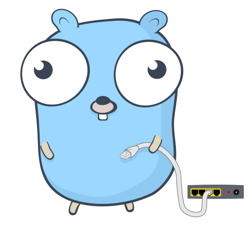

[](https://gitlab.com/devaisgroup/kronos/kronos/commits/master)

Kronos
=========



Overview
-------------------------------
This repository contains the code of the Kronos edge application.

This application requires a MQTT broker to communicate with the Kronos cloud service.

Entities can be created, updated and deleted locally through HTTP and DBus APIs.

Building
-------------------------------
This project requires [Go 1.15+](https://golang.org/doc/install) and
uses [Go Modules](https://github.com/golang/go/wiki/Modules)

Just clone the repository, go to cmd/kronos

```
cd cmd/kronos
```

and run

```
go build
```

This will download all dependencies and build the executable for your current system architecture.

A Makefile is also provided. Run

```
make build
```

to build a binary for each supported architecture. The Makefile also contains other useful targets such as `test`
and `cover`

Configuration
-------------------------------
This project uses [Viper](https://github.com/spf13/viper) to manage configuration.

Configuration can be set through environment variables or files. The supported file formats are JSON, TOML, YAML, HCL,
envfile and Java properties.

By default, a configuration file is loaded from `res/config.*`

Config files can have any of the supported extensions.

The configuration file path can be set with the
`-c, --config-file` command-line flag.

The default configuration can be viewed or saved to a file with the
`print-default-config` and `save-default-config` commands.

Example:

```
./kronos save-default-config default-config.yaml
./kronos --config-file default-config.yaml run
```

Configuration Go structures are in the
[internal/pkg/config](internal/pkg/config) package.

<h3>Environment variables</h3>
Configuration can be set through environment variables.

Environment variables' names are in the following form:
KRONOS_**VARIABLE_PATH**

where **VARIABLE_PATH** is the *upper-snake-case* path of a given variable.

As an example, if we want to override this variable from a configuration file:

```TOML
# config.toml

[Logging]
Level = "info"
```

we should set the environment variable:
```KRONOS_LOGGING_LEVEL=debug```

To get a list of all environment variables along with default values, run the following command:

```
./kronos print-default-config env
```

<h3>Common options</h3>

| Option                       | Description                                          |
| ---------------------------- | ---------------------------------------------------- |
| Logging.Level                | Logging output level |
| Logging.FormatAsJson         | Enable JSON logging |
| Logging.File.Enabled         | Enable file logging |
| Logging.File.Filename        | Logging file name |
| Db.Url                       | Database URL (SQLite file path) |
| Db.WalEnabled                | Enable SQLite [WAL](https://sqlite.org/wal.html) |
| Dbus.Enabled                 | Enable DBus APIs |
| Dbus.UseSystemBus            | Set to true to export DBus interfaces to system bus |
| Dbus.Serialization.Type      | Set DBus serialization protocol (JSON, CBOR, ...)   |
| Http.Enabled                 | Enable HTTP APIs |
| Http.DebugMode               | Enabled debug mode on the HTTP server |
| Http.Host                    | HTTP server address |
| Http.Port                    | HTTP server port |
| Http.PprofEnabled            | Enable Go [Pprof](https://blog.golang.org/pprof) and expose it in the HTTP server |
| Sync.Mqtt.Scheme             | Set MQTT client protocol scheme (tcp, ssl, ...)
| Sync.Mqtt.Host               | Set MQTT broker address |
| Sync.Mqtt.Port               | Set MQTT broker port |
| Sync.Mqtt.Username           | Set MQTT broker username |
| Sync.Mqtt.Password           | Set MQTT broker password |
| Sync.Mqtt.Tls.Enabled        | Enable MQTT over TLS |
| Sync.Mqtt.Tls.ClientCertFile | Set TLS client certificate file |
| Sync.Mqtt.Tls.ClientKeyFile  | Set TLS client private key file |
| Sync.Mqtt.CleanSession       | Enable or disable MQTT session persistence |
| Sync.Mqtt.StorageType        | Set Paho storage type (memory, file, badger) |

DBus APIs
-------------------------------
DBus APIs are disabled by default. You can enable them by setting the configuration `DBus.Enabled` to `true`

By default, DBus objects and interfaces are exposed to the session bus.

Names of paths and interfaces can be changed by configuration.

The definition of objects and methods can be exported as DBus Introspection XML with the following command:

```
./kronos dump-dbus-intro 4
```

where `4` is the XML file indentation level.

HTTP APIs
-------------------------------
HTTP APIs are disabled by default. You can enable them by setting the configuration `Http.Enabled` to `true`

By default, HTTP APIs are bound to `localhost:5000`

Examples:

<h5>Create Item</h5>

```Bash
curl -X POST localhost:5000/items -d '[{"id": "TestItemID", "name": "TestITem00", "type": "TestItem"}]'
```

```JSON
[
  {
    "created_at": 1618325593732,
    "modified_at": 1618325593732,
    "created_by": "HTTP_API",
    "modified_by": "HTTP_API",
    "id": "TestItemID",
    "name": "TestITem00",
    "type": "TestItem",
    "source_timestamp": 0,
    "customer_id": null,
    "is_gateway": false,
    "version": "b1744f5e-8dac-5eb4-84eb-fe390d934c1b",
    "sync_version": null
  }
]
```

<h5>Get All Items</h5>

```Bash
curl "localhost:5000/items?page=1&page_size=5"
```

Running
-------------------------------
After building the application, you can start it with the `run` command.

Here's a list of all supported command-line commands and flags:

```
Usage: kronos <command>

The definitive client/server synchronization tool

Flags:
  -h, --help                  Show context-sensitive help.
  -c, --config-file=STRING    config file
  -d, --verbose               Enable verbose logging output
  -v, --version               Print program version

Commands:
  run                     Run the service
  print-default-config    Prints default configuration
  save-default-config     Save default configuration to file
  print-message-schema    Print synchronization messages as JSON schema
  save-message-schema     Save synchronization messages to JSON schema
  dump-dbus-intro         Print DBus introspectable XML file

Run "kronos <command> --help" for more information on a command.
```

The application can recover from panics, and report them to [Sentry](https://sentry.io/)

It's also possible to report [Prometheus](https://prometheus.io/) metrics.

Sentry
-------------------------------
[Sentry](https://sentry.io/) can be enabled by setting `Sentry.Enabled` to `true` and setting `Sentry.Dsn`
to a valid Sentry installation.

Sentry reports can be configured on a component basis. See `Sync.Sentry` and `Http.Sentry`.

Prometheus
-------------------------------
[Prometheus](https://prometheus.io/) can be enabled by setting `Prometheus.Enabled` to `true`.

[Pushgateways](https://prometheus.io/docs/practices/pushing/) are also supported.
